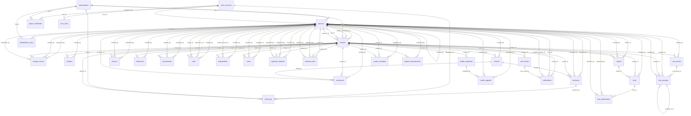

# PostgreSQL relationships (revision 0001)

```mermaid
erDiagram
    persons ||--o{ change_entries : approved_by
    persons ||--o{ change_entries : created_by
    projects ||--o{ change_entries : project_id
    persons ||--o{ change_entries : requested_by
    persons ||--o{ charters : created_by
    projects ||--o{ charters : project_id
    persons ||--o{ cost_entries : created_by
    projects ||--o{ cost_entries : project_id
    persons ||--o{ decisions : created_by
    persons ||--o{ decisions : decided_by
    projects ||--o{ decisions : project_id
    reviews ||--o{ decisions : review_id
    persons ||--o{ facts : created_by
    projects ||--o{ facts : project_id
    reports ||--o{ facts : report_id
    persons ||--o{ lessons : confirmed_by
    persons ||--o{ lessons : created_by
    projects ||--o{ lessons : project_id
    persons ||--o{ milestones : created_by
    projects ||--o{ milestones : project_id
    persons ||--o{ persons : created_by
    organizations ||--o{ persons : org_id
    user_accounts ||--o{ persons : user_id
    persons ||--o{ projects : created_by
    persons ||--o{ projects : initiator_id
    organizations ||--o{ projects : org_id
    persons ||--o{ projects : pm_id
    persons ||--o{ projects : sponsor_id
    persons ||--o{ reports : author_id
    persons ||--o{ reports : created_by
    projects ||--o{ reports : project_id
    persons ||--o{ requirements : accepted_by
    persons ||--o{ requirements : created_by
    projects ||--o{ requirements : project_id
    persons ||--o{ reviews : created_by
    projects ||--o{ reviews : project_id
    persons ||--o{ risks : created_by
    persons ||--o{ risks : handoff_to_id
    persons ||--o{ risks : owner_id
    projects ||--o{ risks : project_id
    persons ||--o{ scorecards : created_by
    projects ||--o{ scorecards : project_id
    reviews ||--o{ scorecards : review_id
    persons ||--o{ scorecards : reviewer_id
    persons ||--o{ stakeholders : created_by
    persons ||--o{ stakeholders : linked_person_id
    projects ||--o{ stakeholders : project_id
    persons ||--o{ tasks : assignee_id
    persons ||--o{ tasks : created_by
    projects ||--o{ tasks : project_id
    user_accounts ||--o{ agent_credentials : delegated_by
    organizations ||--o{ agent_credentials : org_id
    persons ||--o{ approval_requests : decided_by
    persons ||--o{ approval_requests : delegated_by
    projects ||--o{ approval_requests : project_id
    persons ||--o{ approval_requests : requested_by
    decisions ||--o{ audit_logs : decision_id
    user_accounts ||--o{ audit_logs : delegated_by
    organizations ||--o{ audit_logs : org_id
    projects ||--o{ audit_logs : project_id
    cost_entries ||--o{ cost_postings : cost_entry_id
    persons ||--o{ cost_postings : created_by
    cost_postings ||--o{ cost_postings : posting_of_id
    projects ||--o{ cost_postings : project_id
    persons ||--o{ cost_postings : verified_by
    persons ||--o{ evidence_files : owner_id
    projects ||--o{ evidence_files : project_id
    persons ||--o{ evidence_files : uploaded_by
    persons ||--o{ evidence_files : verified_by
    facts ||--o{ fact_clarifications : fact_id
    persons ||--o{ fact_clarifications : requested_by
    persons ||--o{ fact_clarifications : resolved_by
    persons ||--o{ health_appeals : appealed_by
    persons ||--o{ health_appeals : reviewed_by
    health_snapshots ||--o{ health_appeals : snapshot_id
    projects ||--o{ health_snapshots : project_id
    persons ||--o{ idempotency_keys : delegated_by
    organizations ||--o{ idempotency_keys : org_id
    projects ||--o{ notifications : project_id
    persons ||--o{ notifications : read_by
    persons ||--o{ notifications : recipient_person_id
    rule_events ||--o{ notifications : rule_event_id
    persons ||--o{ project_members : assigned_by
    persons ||--o{ project_members : person_id
    projects ||--o{ project_members : project_id
    persons ||--o{ project_retrospectives : confirmed_by
    projects ||--o{ project_retrospectives : project_id
    projects ||--o{ rule_events : project_id
    user_accounts ||--o{ user_roles : user_id
```
